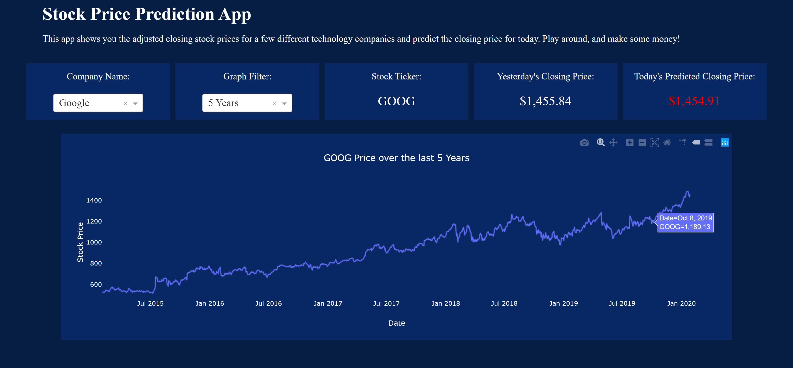

# Stock Price Prediction App

This app is designed to display the stock prices of the last 5 years for a few
different technology companies. It also uses machine learning to predict today's
closing stock price for each of the companies.




The project utilizes a vast amount of historical stock market data to train the machine learning model. This data includes stock prices, trading volumes, and other market indicators. The model learns patterns and relationships between news events and stock price movements, enabling it to make predictions based on similar patterns in the future.

To extract meaningful insights from news articles and other textual data, the project employs natural language processing techniques. These techniques involve parsing and analyzing the text to identify relevant keywords, sentiments, and entities. The model then combines these textual features with historical market data to generate predictions.

The system is designed to adapt and learn from new information continuously. It incorporates a feedback loop that allows it to update its predictions as new data becomes available. This way, the model can adjust its predictions based on changing market conditions and evolving news sentiment.

Overall, the goal of this machine learning project is to provide investors and traders with an additional tool for making informed decisions about stock market investments. By leveraging the power of machine learning and natural language processing, it aims to enhance the accuracy and timeliness of stock price predictions, ultimately helping users navigate the complexities of the financial markets.

## Getting Started

### Prerequisites

You need to have Python installed on your computer and be able to run python
scripts through your terminal.

```
python example_script.py
```

### Installing

After cloning the repository, navigate to the folder, create and activate a virtual environment, and install the required packages in the requirements.txt file.

For Windows machines:
```
cd path/to/repo/folder
python -m venv env
cd env/scripts
activate
cd ../..
python -m pip install -r requirements.txt
```

### Running the App

Before you can run the web app, you need to first train the machine learning
models (should take less than a minute). If you do not train the models first,
the dash_app.py script will error out. Running this script will train a machine
learning model for each of the companies and save the model and StandardScaler
object into a models folder in the current working directory.

```
python train_models.py
```

After training the models, you need to run the dash_app.py script and navigate
to the url shown in the terminal.

```
python dash_app.py
```

## Built With

* [Plotly](https://plot.ly/python/plotly-express/) - The framework used to build the chart
* [Dash](https://plot.ly/dash/) - The framework used to build the web app
* [Scikit-Learn](https://scikit-learn.org/stable/) - The framework used to build the machine learning models
* [yfinance](https://pypi.org/project/yfinance/) - The API used to pull the stock price data from Yahoo! Finance
